# 端云同步领域知识

> 本文档为 Agent 知识路由目标，由 `services/distributeddataservice/service/cloud/AGENTS.md` 的 vocabulary-based / path-based routing 触发阅读。

## 1. 核心类关系

### 1.1 端云服务核心类关系图

> 类图仅展示关键公有接口和端云相关成员，完整定义请查看对应头文件。

```mermaid
classDiagram
    class CloudServiceStub {
        +DECLARE_INTERFACE_DESCRIPTOR OHOS.CloudData.CloudServer
        +OnRemoteRequest(code, data, reply) int
        +HANDLERS TRANS_BUTT Handler[]
    }
    class CloudServiceImpl {
        +EnableCloud / DisableCloud / ChangeAppSwitch
        +Clean / NotifyDataChange
        +QueryStatistics / QueryLastSyncInfo / QueryLastSyncInfoBatch
        +SetGlobalCloudStrategy / CloudSync / StopCloudSyncTask / StopCloudSyncForStore / InitNotifier
        +Subscribe / Unsubscribe / SubscribeCloudSyncTrigger / UnSubscribeCloudSyncTrigger
        +AllocResourceAndShare / Share / Unshare / Exit / ChangePrivilege / Query / QueryByInvitation / ConfirmInvitation / ChangeConfirmation
        +SetCloudStrategy
        +OnInitialize / OnBind / OnUserChange / OnReady / Offline / OnScreenUnlocked
        -RETRY_TIMES 3 / EXPIRE_INTERVAL 2*24 / NOTIFY_DELAY 5s
    }
    class SyncManager {
        +DoCloudSync SyncInfo
        +StopCloudSync user
        +QueryLastSyncInfo
        +static GetStore meta user mustBind
        +Bind executor
        +OnNetworkDisconnected / OnNetworkConnected / OnScreenUnlocked
        +CleanCompensateSync / ClearLastSyncInfo
        +static Report / static GetPath
    }
    class CloudServer {
        +static GetInstance CloudServer
        +static RegisterCloudInstance instance bool
        +GetServerInfo userId needSpaceInfo pair~int32_t CloudInfo~
        +GetAppSchema userId bundleName pair~int32_t SchemaMeta~
        +Subscribe userId dbs int32_t
        +Unsubscribe userId dbs int32_t
        +ConnectAssetLoader 2重载 shared_ptr~AssetLoader~
        +ConnectCloudDB 2重载 shared_ptr~CloudDB~
        +ConnectSharingCenter userId bunleName shared_ptr~SharingCenter~
        +Clean userId / ReleaseUserInfo userId / Bind executor
        +IsSupportCloud userId bool / CloudDriverUpdated bundleName bool
        +GetConflictHandler shared_ptr~CloudConflictHandler~
    }
    class CloudDB {
        +virtual Execute / BatchInsert / BatchUpdate 2重载 / BatchDelete
        +virtual Query 2重载 / PreSharing
        +virtual Sync / StopCloudSync
        +virtual Watch / Unwatch / Lock / Heartbeat / Unlock
        +virtual AliveTime int64_t / Close int32_t / GetEmptyCursor / SetPrepareTraceId / HasCloudUpdate bool
    }
    class CloudInfo {
        +DEFAULT_BATCH_NUMBER 30 / DEFAULT_BATCH_SIZE 1.5M
        +AppInfo bundleName appId version instanceId cloudSwitch
        +user id totalSpace remainSpace maxNumber maxSize enableCloud apps
        +GetKey / GetSchemaKey / GetSchemaPrefix / IsValid / Exist / IsOn / IsAllSwitchOff / GetAppInfo
    }
    class SchemaMeta {
        +14个系统字段常量
        +CURRENT_VERSION 0x10001 / CLEAN_WATER_VERSION 0x10001
        +metaVersion version bundleName databases e2eeEnable
        +GetLowVersion / GetHighVersion / IsValid / GetDataBase / GetStores
    }
    class Database {
        +name alias tables autoSyncType user deviceId version bundleName
        +GetKey / GetPrefix / GetTableNames / GetSyncTables / GetCloudTables
    }
    class Table {
        +name sharedTableName alias fields cloudSyncFields
    }
    class Field {
        +colName alias type primary autoIncrement nullable dupCheckCol
    }
    class Subscription {
        +userId id expiresTime
        +Relation id bundleName relations
        +GetKey / GetRelationKey / GetMinExpireTime / GetPrefix
    }
    class SharingCenter {
        +Role / Confirmation / SharingCode枚举
        +Privilege / Participant结构
        +Participants / Results / QueryResults类型
        +SHARING_ERR_OFFSET
        +所有方法均为virtual Share Unshare Exit ChangePrivilege Query QueryByInvitation ConfirmInvitation ChangeConfirmation
    }
    class GeneralStore {
        +端云核心枚举结构详见 general_store.h
        +Sync / StopCloudSync / Bind / IsBound / Clean / LockCloudDB / UnLockCloudDB
        +SetCloudConflictHandler / PreSharing / SetConfig / SetEqualIdentifier / BindSnapshots
        +UpdateDBStatus / SetCacheFlag / PublishCacheChange
    }
    class AutoCache {
        +StoreOption createRequired false
        +static GetInstance
        +GetStore / GetDBStore
    }
    class AssetLoader {
        +Download 2重载
        +RemoveLocalAssets / CancelDownload / SetStoreMetaKey
    }
    class CloudConflictHandler {
        +HandleConflict table oldData newData upsert int32_t
    }

    CloudServiceStub <|-- CloudServiceImpl
    CloudServiceImpl --> SyncManager : 使用
    CloudServiceImpl --> CloudServer : 获取云组件
    SyncManager --> GeneralStore : 执行同步
    SyncManager --> CloudDB : 云端操作
    CloudServer --> CloudDB : 创建
    CloudServer --> SharingCenter : 创建
    CloudServer --> AssetLoader : 创建
    GeneralStore --> AutoCache : 缓存管理
    GeneralStore --> CloudConflictHandler : 使用
    SchemaMeta *-- Database : 包含
    Database *-- Table : 包含
    SharingCenter --> Participant : 使用
```

### 1.2 端云同步相关类图

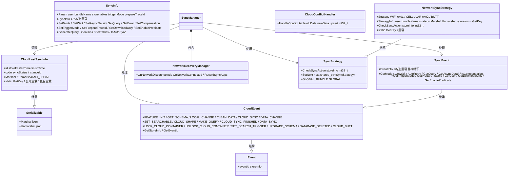

---

## 2. 时序图

### 2.1 端云同步时序图

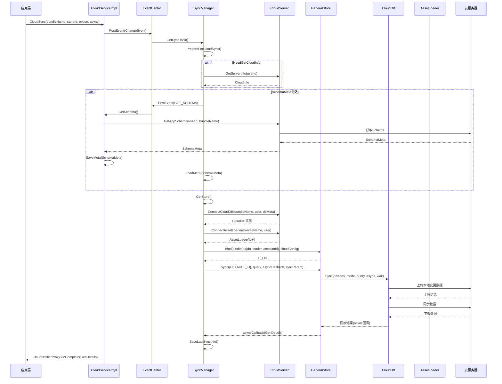

### 2.2 端云订阅时序图

**流程A：应用订阅通知（本地记录）**

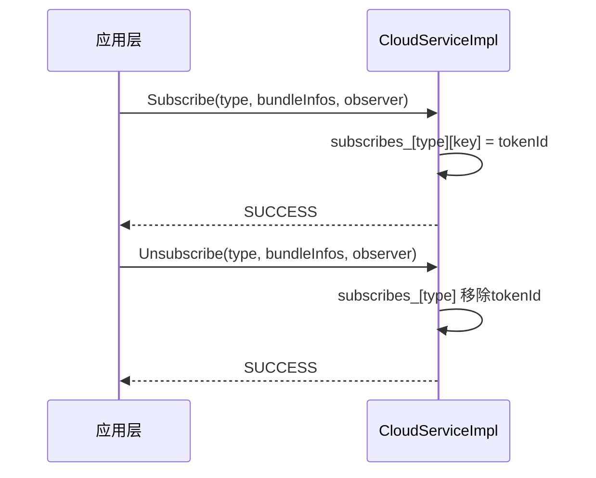

**流程B：后台定时云端订阅**

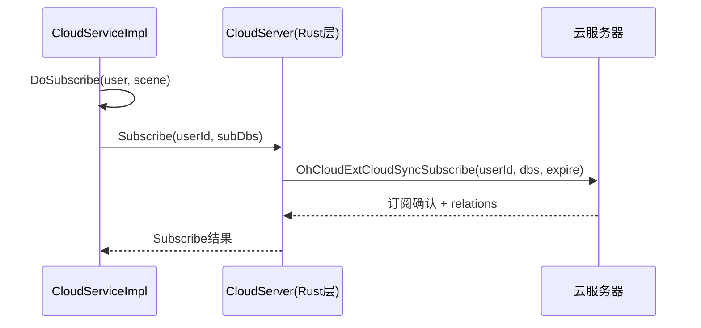

**流程C：数据变更通知**

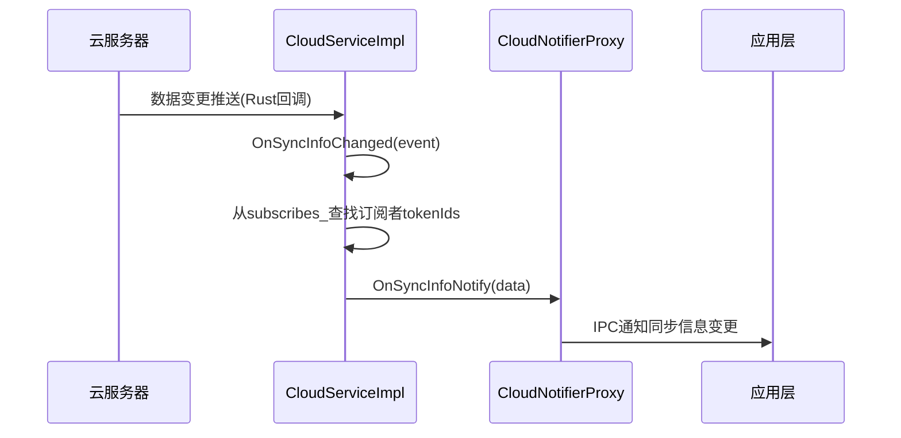

### 2.3 云数据共享时序图

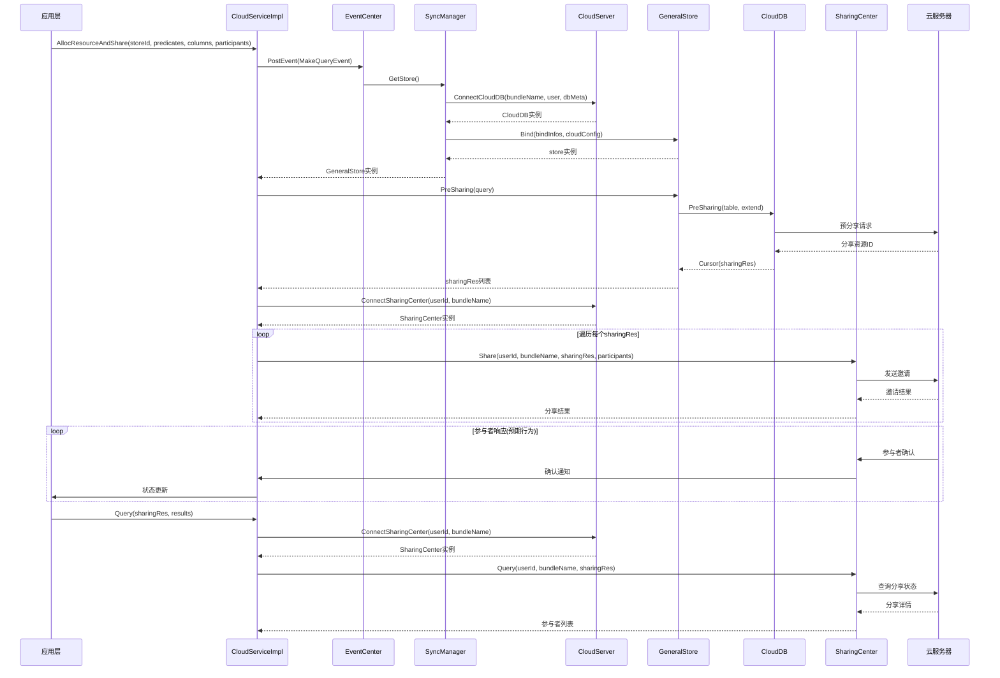

---

## 3. 流程图

### 3.1 端云同步主流程

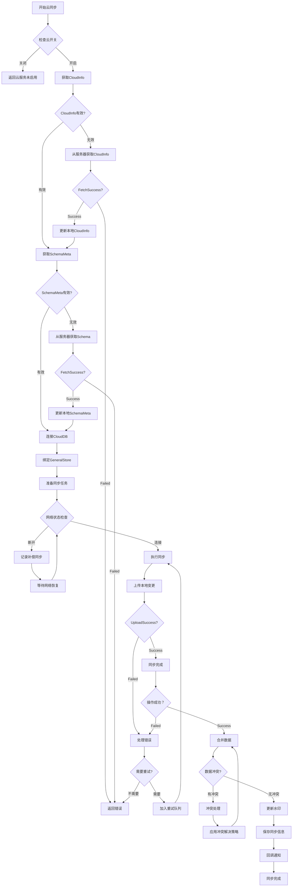

### 3.2 数据变更通知流程

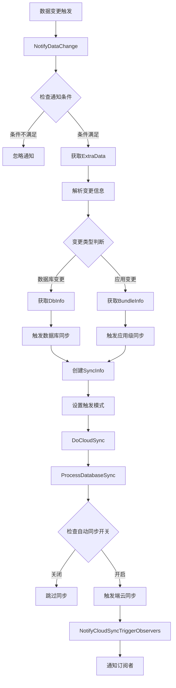

---

## 4. 状态机

### 4.1 端云同步状态机

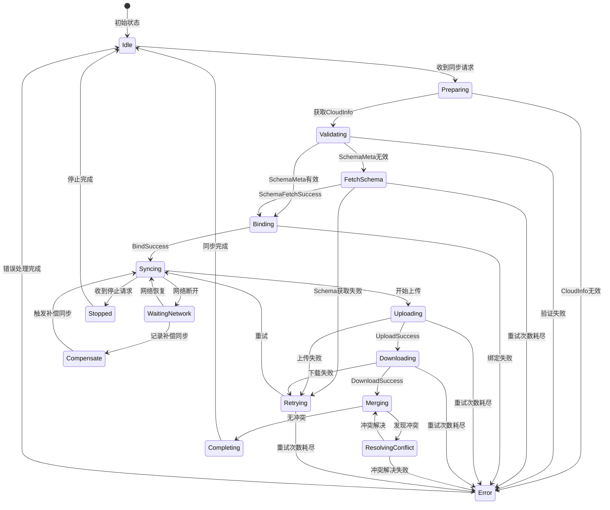

### 4.2 云开关状态机

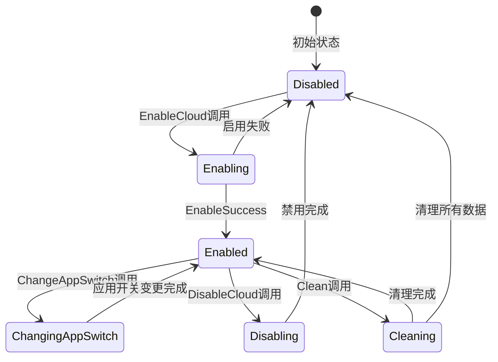

### 4.3 云订阅状态机

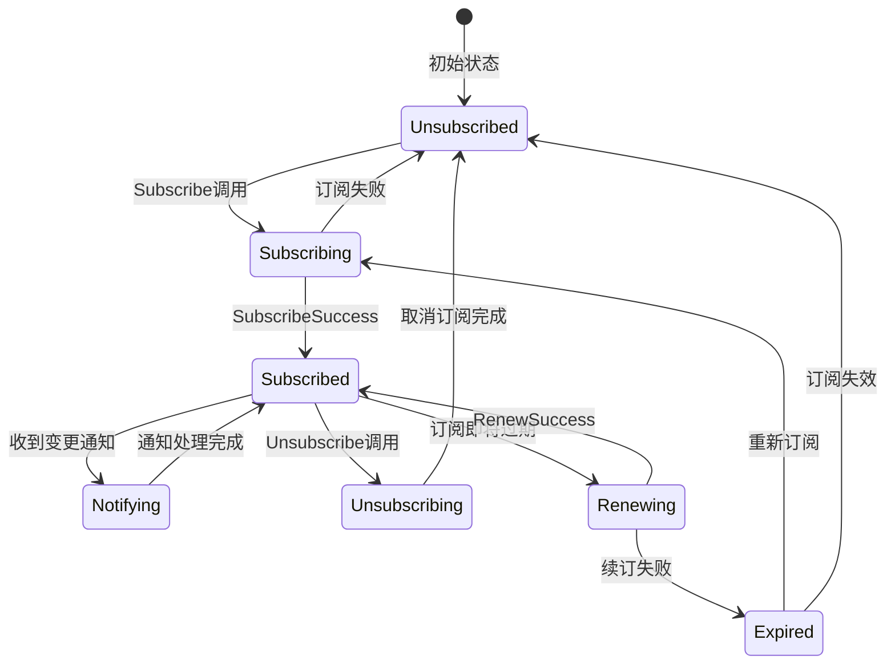

---

## 5. 用例图

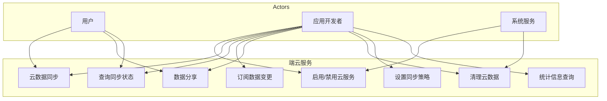

---

## 6. 内部模块依赖

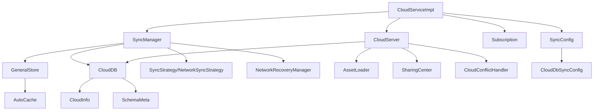

---

## 7. 错误处理

### 7.1 SharingCenter 分享错误码

| 错误码 | 值 | 说明 |
|--------|-----|------|
| SUCCESS | 0 | 成功 |
| REPEATED_REQUEST | 1 | 重复请求 |
| NOT_INVITER | 2 | 非邀请者 |
| NOT_INVITER_OR_INVITEE | 3 | 非邀请者或受邀者 |
| OVER_QUOTA | 4 | 超出配额 |
| TOO_MANY_PARTICIPANTS | 5 | 参与者过多 |
| INVALID_ARGS | 6 | 参数无效 |
| NETWORK_ERROR | 7 | 网络错误 |
| CLOUD_DISABLED | 8 | 云服务未启用 |
| SERVER_ERROR | 9 | 服务器错误 |
| INNER_ERROR | 10 | 内部错误 |
| INVALID_INVITATION | 11 | 无效邀请 |
| RATE_LIMIT | 12 | 速率限制 |
| IPC_ERROR | 13 | IPC错误 |
| NOT_SUPPORT | 14 | 不支持 |
| CUSTOM_ERROR | 1000 | 自定义错误起始值 |

### 7.2 CloudServiceImpl 常量

```cpp
static constexpr uint64_t INVALID_SUB_TIME = 0;
static constexpr int32_t RETRY_TIMES = 3;
static constexpr int32_t RETRY_INTERVAL = 60;
static constexpr int32_t EXPIRE_INTERVAL = 2 * 24;   // 2天
static constexpr int32_t WAIT_TIME = 30;
static constexpr int32_t DEFAULT_USER = 0;
static constexpr int32_t TIME_BEFORE_SUB = 12 * 60 * 60 * 1000;  // 12小时(ms)
static constexpr int32_t SUBSCRIPTION_INTERVAL = 60 * 60 * 1000;  // 1小时(ms)
static constexpr ExecutorPool::Duration NOTIFY_DELAY = std::chrono::seconds(5);
static constexpr Handle WORK_CLOUD_INFO_UPDATE = &CloudServiceImpl::UpdateCloudInfo;
static constexpr Handle WORK_SCHEMA_UPDATE = &CloudServiceImpl::UpdateSchema;
static constexpr Handle WORK_SUB = &CloudServiceImpl::DoSubscribe;
static constexpr Handle WORK_RELEASE = &CloudServiceImpl::ReleaseUserInfo;
static constexpr Handle WORK_DO_CLOUD_SYNC = &CloudServiceImpl::DoCloudSync;
static constexpr Handle WORK_STOP_CLOUD_SYNC = &CloudServiceImpl::StopCloudSync;
```

### 7.3 SyncManager 常量

```cpp
static constexpr ExecutorPool::Duration RETRY_INTERVAL = std::chrono::seconds(10);
static constexpr ExecutorPool::Duration LOCKED_INTERVAL = std::chrono::seconds(30);
static constexpr ExecutorPool::Duration BUSY_INTERVAL = std::chrono::seconds(180);
static constexpr int32_t RETRY_TIMES = 6;
static constexpr int32_t CLIENT_RETRY_TIMES = 3;
static constexpr uint64_t USER_MARK = 0xFFFFFFFF00000000;
static constexpr int32_t MV_BIT = 32;
static constexpr int32_t EXPIRATION_TIME = 6 * 60 * 60 * 1000;  // 6小时(ms)
```

---

## 8. 安全说明

### 8.1 权限要求

| 权限 | 说明 |
|------|------|
| ohos.permission.CLOUDFILE_SYNC | 云文件同步权限 |
| ohos.permission.GET_NETWORK_INFO | 获取网络信息权限 |
| ohos.permission.MONITOR_DEVICE_NETWORK_STATE | 监控设备网络状态权限(ACL) |
| ohos.permission.USE_CLOUD_DRIVE_SERVICE | 使用云盘服务权限 |

---

## 9. 配置说明

### 9.1 服务配置文件

**文件**：`services/distributeddataservice/app/distributed_data.cfg`

> 以下仅列出端云相关配置，完整配置请查看配置文件。

| 端云相关配置 | 说明 |
|-------------|------|
| permission（端云相关） | CLOUDFILE_SYNC / GET_NETWORK_INFO / MONITOR_DEVICE_NETWORK_STATE / USE_CLOUD_DRIVE_SERVICE / PUBLISH_SYSTEM_COMMON_EVENT / GET_BUNDLE_INFO / GET_BUNDLE_INFO_PRIVILEGED |
| permission_acls（端云相关） | MONITOR_DEVICE_NETWORK_STATE |

### 9.2 云同步配置

```cpp
struct CloudConfig {
    int32_t maxNumber = 30;              // 最大批次数量
    int32_t maxSize = 1024 * 512 * 3;    // 最大批次大小 1.5MB
    int32_t maxRetryConflictTimes = 3;   // 冲突重试次数
    bool isSupportEncrypt = false;       // 是否支持加密
};
```

---

## 10. API 兼容性规范

### 10.1 IPC 接口规则

- CloudServiceStub Handler 编号不得重新分配，新增只能追加。
- IPC 参数顺序变更视为破坏性变更。
- 回调语义变更（如 OnComplete 回调参数含义）影响应用层，必须明确标注。
- 权限声明变更属于兼容性敏感变更，必须经审批。

### 10.2 跨模块类型定义

- `cloud_types.h` 中的 Role/Confirmation/Privilege/Participant/Strategy 等类型由 `distributeddatamgr_relational_store` 定义。
- 变更这些类型需同步确认 relational_store 侧的兼容性。

### 10.3 兼容性检查方法

- 检查 CloudServiceStub Handler 编号是否只增不减。
- 检查 IPC 参数顺序是否与上一版本一致。
- 检查错误码是否只追加不修改。
- 检查 `cloud_types.h` 类型定义是否与 relational_store 侧对齐。
