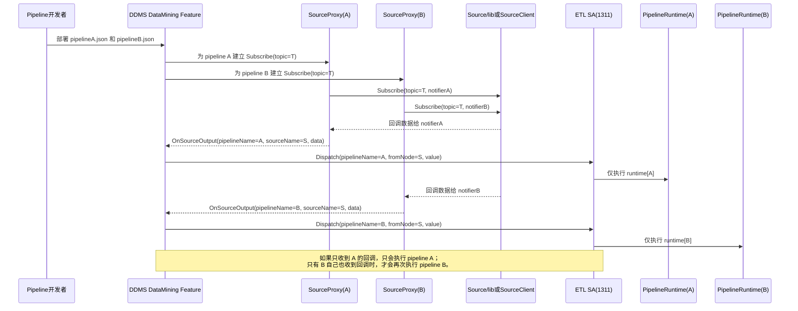
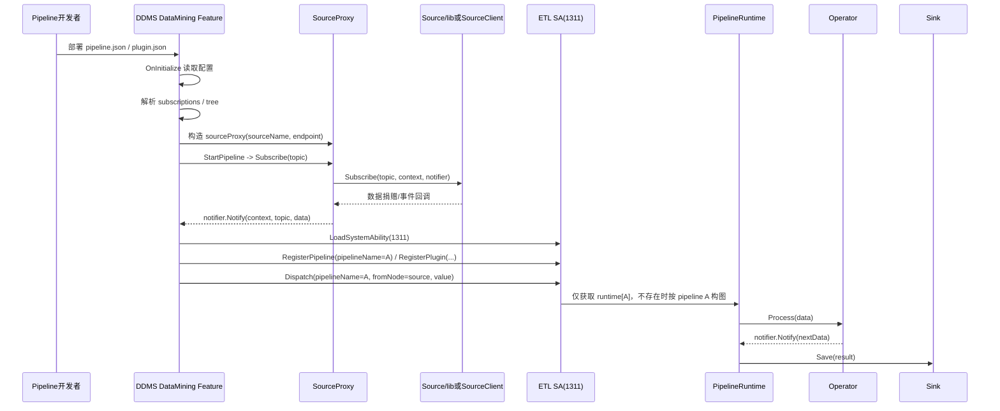
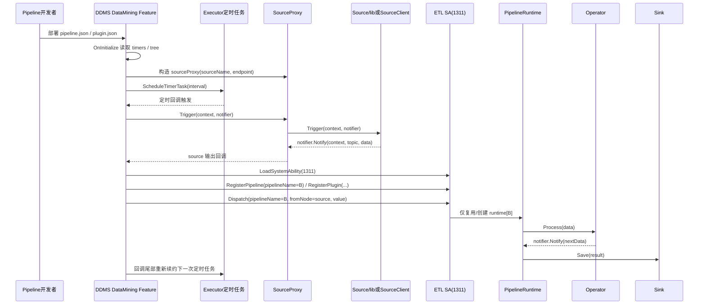

# Data Mining 时序图

## 多 Pipeline 说明

- DDMS 在 source 回调时会带上 `pipelineName` 和 `sourceName`，只把本次命中的那条 pipeline 送到 ETL SA。
- ETL SA 内部按 `pipelineName` 维护 `pipelines_[pipelineName]` 和 `runtimes_[pipelineName]`，`Dispatch` 不会广播执行所有 pipeline。
- 如果多个 pipeline 同时订阅了同一个 source/topic，那么会出现“各自独立触发、各自独立 dispatch”的效果；这是多策略并存带来的结果，不是 ETL SA 误执行了全量 pipeline。

## 多 Pipeline 共享同一 Source/Topic

## 订阅型 Pipeline

## 定时型 Pipeline

