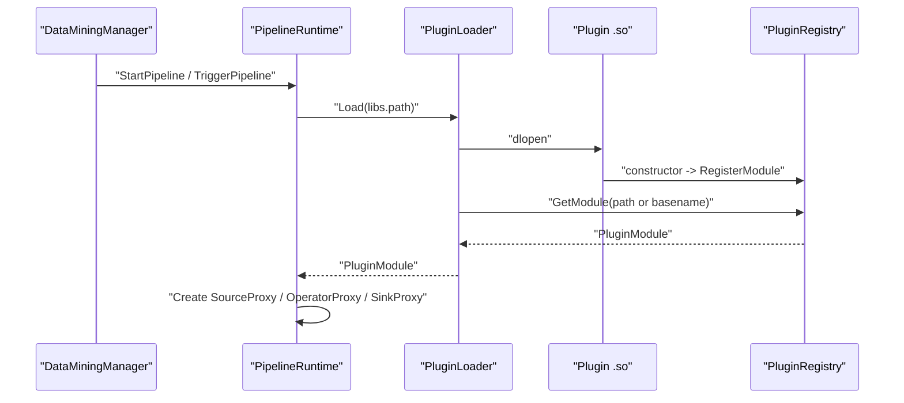
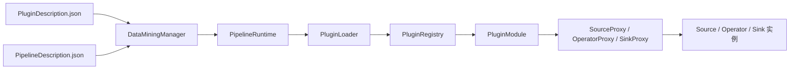
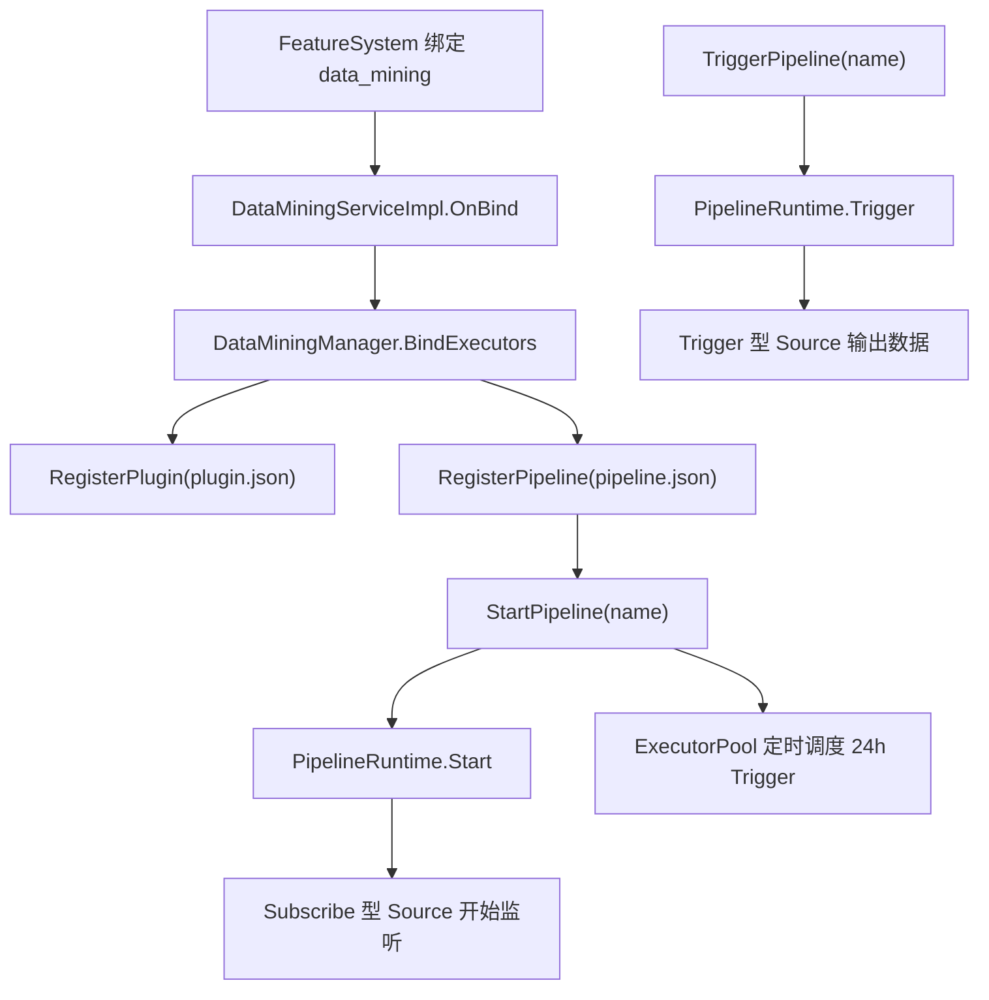
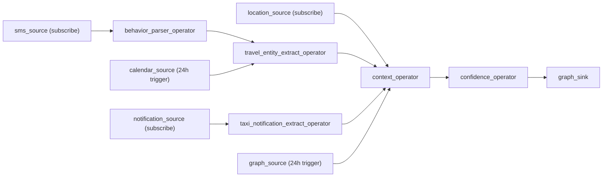

# 数据挖掘 ETL 模块说明

> 2026-03 结构更新说明：
> - 公共 ETL 接口、Plugin/Pipeline 描述、PluginLoader/EndpointConfig 等统一迁移到兄弟目录 `foundation/distributeddatamgr/data_mining`
> - demo 迁移到兄弟目录 `foundation/distributeddatamgr/data_mining_demo`
> - DDMS 目录仅保留 feature 编排与 source bridge，不再保留公共 `source/operator/sink/runtime` 定义副本

## 1. 模块定位

`data_mining` 是 `datamgr_service` 中面向 OpenHarmony 场景数据挖掘的 ETL 框架。

当前目标不是做一个“单次脚本式”的 ETL 工具，而是做一套可共建的算子框架：

- Source 开发者提供数据源采集能力
- Operator 开发者提供数据转换和数据理解能力
- Sink 开发者提供数据落地能力
- Pipeline 开发者只负责编排，不直接写算子
- `datamgr_service` 负责动态加载、图编排、触发调度和服务侧管理

当前接入形态分三种：

- `so` 动态库接入：主实现路径，已完整落骨架
- `SA` 接入：已预留 proxy 和 endpoint，当前为粗实现
- `Extension` 接入：已预留 proxy 和 endpoint，当前为粗实现

## 2. 这次重构解决了什么问题

上一版代码的主要问题是职责混杂，公共接口、运行时逻辑、插件注册、pipeline 编排全塞在少数几个大文件里，导致：

- 开发者接口和框架内部接口混在一起
- `Context` 被塞进不属于框架的业务字段
- `std::any` 和节点身份传递耦合过深
- `RegisterModule` 仍要求开发者在 json 里重复写 symbol
- demo 只是线性玩具链路，无法解释真实场景

现在改成了按职责拆分的结构：

```text
data_mining/
├── include/
│   ├── interfaces/         # 只给算子开发者继承的 ETL 接口
│   ├── plugin/             # 给 so 开发者使用的模块导出接口
│   ├── model/              # PluginDescription / PipelineDescription
│   ├── runtime/            # 框架内部运行时、proxy、loader、registry
│   └── service/            # datamgr_service 侧总控
├── src/
│   ├── interfaces/
│   ├── plugin/
│   ├── model/
│   ├── runtime/
│   └── service/
├── demo/
│   ├── common/
│   ├── sources/
│   ├── operators/
│   └── sinks/
└── config/
    ├── plugins/
    └── pipelines/
```

## 3. 两类开发者

### 3.1 算子开发者

算子开发者维护两部分内容：

- 代码：实现 `Source` / `Operator` / `Sink`
- 配置：维护 `PluginDescription`

算子开发者关注的是：

- 我提供的算子名字是什么
- 它是 source/operator/sink 中的哪一种
- 它的输入输出类型是什么
- 它通过 so / SA / Extension 哪种方式接入

### 3.2 Pipeline 开发者

Pipeline 开发者不实现算子，只做编排，维护 `PipelineDescription`。

Pipeline 开发者关注的是：

- 这条工作流叫什么
- 哪些 source、operator、sink 要连起来
- 哪些节点是 fanout，哪些节点需要汇合
- 是订阅触发、手动触发还是定时触发

## 4. 公共接口与内部接口

### 4.1 只给算子开发者的公共接口

`[etl_interfaces.h](/Z:/home/lizhuojun/workspace/oh/foundation/distributeddatamgr/data_mining/include/etl_interfaces.h)` 现在只做一个公共聚合头，里面只包含：

- `[Context](/Z:/home/lizhuojun/workspace/oh/foundation/distributeddatamgr/data_mining/include/interfaces/context.h)`
- `[Data / DataValue](/Z:/home/lizhuojun/workspace/oh/foundation/distributeddatamgr/data_mining/include/interfaces/data.h)`
- `[Basic Values](/Z:/home/lizhuojun/workspace/oh/foundation/distributeddatamgr/data_mining/include/interfaces/basic_value.h)`
- `[Merged Input View](/Z:/home/lizhuojun/workspace/oh/foundation/distributeddatamgr/data_mining/include/interfaces/payload.h)`
- `[AsyncNotifier](/Z:/home/lizhuojun/workspace/oh/foundation/distributeddatamgr/data_mining/include/interfaces/async_notifier.h)`
- `[Source](/Z:/home/lizhuojun/workspace/oh/foundation/distributeddatamgr/data_mining/include/interfaces/source.h)`
- `[Operator](/Z:/home/lizhuojun/workspace/oh/foundation/distributeddatamgr/data_mining/include/interfaces/operator.h)`
- `[Sink](/Z:/home/lizhuojun/workspace/oh/foundation/distributeddatamgr/data_mining/include/interfaces/sink.h)`

这里不再放 loader、proxy、registry、pipeline runtime 这些框架内部对象。

### 4.2 关键接口说明

`Context`

- 只保留 `data` 和 `parameters` 两个字符串
- 推荐写 JSON 字符串
- 不再维护 `operatorName`

`Data / DataValue`

- 替代 `std::any`
- 通过 `QueryInterface<T>()` 做类型查询
- 框架提供 `DataValue` / QueryInterface 机制，以及 `StringValue`、`JsonValue`、`BytesValue` 这 3 个基础原始值
- 框架只额外提供 `IRecordBatchView`，用于多父节点输入合流

`AsyncNotifier`

- 只保留一个纯虚接口：`Notify(context, topic, data)`
- 不再单独做一个具体 `AsyncData` 类

`Source`

- `Trigger` 和 `Subscribe` 是两种互斥模式
- `Unsubscribe` 现在也必须带 `topic`
- `GetName()` 为虚函数，子类直接写死名字

`Operator`

- 只保留异步风格 `Process`
- 同步返回对象的旧接口已经去掉

## 5. 动态库注册方式

现在的 so 接入不再要求开发者在 json 里再写一遍 `RegisterSymbol / UnregisterSymbol`。

json 里只保留：

- 动态库路径 `libs.path`
- 算子描述 `ops`
- 未来的 `sa` / `extension` 信息

真正的 so 注册方式改成了和 napi 类似的 constructor 自注册模型：

- so 被 `dlopen`
- `DATA_MINING_REGISTER_MODULE(...)` 触发 constructor
- constructor 调用 `PluginRegistry::RegisterModule`
- `PluginLoader` 再从注册表中取回 `PluginModule`

### 5.1 关键文件

- `[plugin_module.h](/Z:/home/lizhuojun/workspace/oh/foundation/distributeddatamgr/data_mining/include/plugin/plugin_module.h)`
- `[plugin_export.h](/Z:/home/lizhuojun/workspace/oh/foundation/distributeddatamgr/data_mining/include/plugin/plugin_export.h)`
- `[plugin_registry.h](/Z:/home/lizhuojun/workspace/oh/foundation/distributeddatamgr/data_mining/include/runtime/plugin_registry.h)`
- `[plugin_loader.h](/Z:/home/lizhuojun/workspace/oh/foundation/distributeddatamgr/data_mining/include/runtime/plugin_loader.h)`

### 5.2 动态加载时序图



## 6. 运行时架构

运行时不是直接拿到算子实例就串起来，而是拆成 4 层：

- `PluginLoader`：负责 so 装载
- `PluginRegistry`：负责进程内模块注册表
- `SourceProxy / OperatorProxy / SinkProxy`：统一屏蔽 so / SA / Extension
- `PipelineRuntime`：负责图绑定、触发、路由、汇合

整体关系如下：



## 7. 为什么不再把节点名放进 Context

这是这次改造的一个核心点。

旧思路是把 `operatorName` 塞到 `Context` 里，让 runtime 从上下文里猜“是谁发出来的数据”。这个设计不对，因为：

- `Context` 应该表达业务上下文，不该承载运行时控制信息
- 一旦跨 so，谁写谁读都不清晰
- 框架会被迫理解大量业务字段

现在改成了 `NodeNotifier` 模型：

- 每个运行时节点创建一个自己的 `NodeNotifier`
- 算子调用 `notifier->Notify(...)`
- `NodeNotifier` 把“当前节点名”带回 `PipelineRuntime`
- `PipelineRuntime` 再按照图把数据路由给下游

对应代码在：

- `[pipeline_runtime.h](/Z:/home/lizhuojun/workspace/oh/foundation/distributeddatamgr/datamgr_service/services/data_mining_service/include/runtime/pipeline_runtime.h)`
- `[pipeline_runtime.cpp](/Z:/home/lizhuojun/workspace/oh/foundation/distributeddatamgr/datamgr_service/services/data_mining_service/src/runtime/pipeline_runtime.cpp)`

## 8. 多父节点汇合逻辑

当前 pipeline 不是线性的，而是图状的。

当某个 operator 有多个父节点时，`PipelineRuntime` 会：

1. 根据图结构计算该节点需要等待哪些父节点
2. 把每个父节点的输出暂存到 `pendingInputs_`
3. 等父节点输入凑齐后再组装成运行时内部的 `MergedDataValue`
4. 再把这个合流数据投递给当前 operator

这就是为什么 `travel_entity_extract_operator` 和 `context_operator` 可以做汇合。

## 9. 服务侧控制面

`data_mining` 作为一个 feature，入口仍然是：

- `[data_mining_service_impl.h](/Z:/home/lizhuojun/workspace/oh/foundation/distributeddatamgr/datamgr_service/services/distributeddataservice/service/data_mining/data_mining_service_impl.h)`
- `[data_mining_service_impl.cpp](/Z:/home/lizhuojun/workspace/oh/foundation/distributeddatamgr/datamgr_service/services/distributeddataservice/service/data_mining/data_mining_service_impl.cpp)`

但真正的业务总控已经下沉到：

- `[data_mining_manager.h](/Z:/home/lizhuojun/workspace/oh/foundation/distributeddatamgr/datamgr_service/services/distributeddataservice/service/data_mining/include/service/data_mining_manager.h)`
- `[data_mining_manager.cpp](/Z:/home/lizhuojun/workspace/oh/foundation/distributeddatamgr/datamgr_service/services/distributeddataservice/service/data_mining/src/service/data_mining_manager.cpp)`

控制流程如下：



## 10. 一键打车 demo 场景

### 10.1 Source

当前 demo 里有 5 个 source：

- `sms_source`：订阅短信变化
- `location_source`：订阅位置变化
- `notification_source`：订阅通知变化
- `calendar_source`：每天 24h 触发一次
- `graph_source`：每天 24h 触发一次

对应代码在：

- `[sms_source.cpp](/Z:/home/lizhuojun/workspace/oh/foundation/distributeddatamgr/data_mining_demo/sources/sms_source.cpp)`
- `[location_source.cpp](/Z:/home/lizhuojun/workspace/oh/foundation/distributeddatamgr/data_mining_demo/sources/location_source.cpp)`
- `[notification_source.cpp](/Z:/home/lizhuojun/workspace/oh/foundation/distributeddatamgr/data_mining_demo/sources/notification_source.cpp)`
- `[calendar_source.cpp](/Z:/home/lizhuojun/workspace/oh/foundation/distributeddatamgr/data_mining_demo/sources/calendar_source.cpp)`
- `[graph_source.cpp](/Z:/home/lizhuojun/workspace/oh/foundation/distributeddatamgr/data_mining_demo/sources/graph_source.cpp)`

### 10.2 Operator

当前 demo 里有 5 个 operator：

- `behavior_parser_operator`
- `travel_entity_extract_operator`
- `taxi_notification_extract_operator`
- `context_operator`
- `confidence_operator`

对应代码在：

- `[behavior_parser_operator.cpp](/Z:/home/lizhuojun/workspace/oh/foundation/distributeddatamgr/data_mining_demo/operators/behavior_parser_operator.cpp)`
- `[travel_entity_extract_operator.cpp](/Z:/home/lizhuojun/workspace/oh/foundation/distributeddatamgr/data_mining_demo/operators/travel_entity_extract_operator.cpp)`
- `[taxi_notification_extract_operator.cpp](/Z:/home/lizhuojun/workspace/oh/foundation/distributeddatamgr/data_mining_demo/operators/taxi_notification_extract_operator.cpp)`
- `[context_operator.cpp](/Z:/home/lizhuojun/workspace/oh/foundation/distributeddatamgr/data_mining_demo/operators/context_operator.cpp)`
- `[confidence_operator.cpp](/Z:/home/lizhuojun/workspace/oh/foundation/distributeddatamgr/data_mining_demo/operators/confidence_operator.cpp)`

### 10.3 Sink

当前 sink 只有一个：

- `graph_sink`

对应代码在：

- `[graph_sink.cpp](/Z:/home/lizhuojun/workspace/oh/foundation/distributeddatamgr/data_mining_demo/sinks/graph_sink.cpp)`

### 10.4 Pipeline 图

一键打车 pipeline 的编排目标是：

- 订阅侧先持续收集短信、位置、通知
- 定时侧再每天读取日历和图谱快照
- 先从短信中抽行为，再和日历一起抽出行实体
- 从通知里抽打车相关实体
- 最后把位置、出行实体、通知实体、图谱画像汇总成场景上下文
- 由置信度算子给出最终推荐分数
- Sink 落到图谱数据库

配置文件在：

- `[one_touch_taxi_pipeline.json](/Z:/home/lizhuojun/workspace/oh/foundation/distributeddatamgr/datamgr_service/services/distributeddataservice/service/data_mining/config/pipelines/one_touch_taxi_pipeline.json)`

图如下：



### 10.5 混合触发如何工作

这条 pipeline 的 `trigger.type` 是 `hybrid`：

- `StartPipeline` 时：`sms/location/notification` 三个 subscribe 型 source 先注册监听
- 如果未显式 `StartPipeline`，第一次 `TriggerPipeline` 也会懒启动 runtime
- 监听到变化后：这些 source 直接 `Notify`
- 24h 定时到达或手动触发时：`calendar/graph` 两个 trigger 型 source 被主动调用
- 运行时等多路输入凑齐后，汇合节点再继续向下游执行

## 11. 配置文件位置

插件描述：

- `[config/plugins](/Z:/home/lizhuojun/workspace/oh/foundation/distributeddatamgr/datamgr_service/services/distributeddataservice/service/data_mining/config/plugins)`

Pipeline 描述：

- `[config/pipelines](/Z:/home/lizhuojun/workspace/oh/foundation/distributeddatamgr/datamgr_service/services/distributeddataservice/service/data_mining/config/pipelines)`

Demo 构建脚本：

- `[build_demo.sh](/Z:/home/lizhuojun/workspace/oh/foundation/distributeddatamgr/data_mining_demo/build_demo.sh)`

## 12. 建议阅读顺序

如果要快速理解当前实现，建议按下面顺序看：

1. `[etl_interfaces.h](/Z:/home/lizhuojun/workspace/oh/foundation/distributeddatamgr/data_mining/include/etl_interfaces.h)`
2. `[plugin_export.h](/Z:/home/lizhuojun/workspace/oh/foundation/distributeddatamgr/data_mining/include/plugin/plugin_export.h)`
3. `[plugin_description.h](/Z:/home/lizhuojun/workspace/oh/foundation/distributeddatamgr/data_mining/include/model/plugin_description.h)`
4. `[pipeline_description.h](/Z:/home/lizhuojun/workspace/oh/foundation/distributeddatamgr/data_mining/include/model/pipeline_description.h)`
5. `[pipeline_runtime.cpp](/Z:/home/lizhuojun/workspace/oh/foundation/distributeddatamgr/datamgr_service/services/data_mining_service/src/runtime/pipeline_runtime.cpp)`
6. `[data_mining_manager.cpp](/Z:/home/lizhuojun/workspace/oh/foundation/distributeddatamgr/datamgr_service/services/distributeddataservice/service/data_mining/src/service/data_mining_manager.cpp)`
7. `[one_touch_taxi_pipeline.json](/Z:/home/lizhuojun/workspace/oh/foundation/distributeddatamgr/datamgr_service/services/distributeddataservice/service/data_mining/config/pipelines/one_touch_taxi_pipeline.json)`
8. `demo/sources -> demo/operators -> demo/sinks`

## 13. 当前边界

当前版本已经把结构、插件接入和图编排骨架改到了可继续演进的状态，但仍有这些边界：

- `SA` 和 `Extension` 目前是 proxy 骨架，不是完整远端调用
- 还没有把完整 IPC 控制面铺到 `OnRemoteRequest`
- UT / Fuzz 仍是旧接口风格，后续需要整体重写
- demo 构建脚本目前是本地示意脚本，真实可运行插件仍需要对接最终的框架链接环境
- 这轮没有做完整编译和自动化验证
