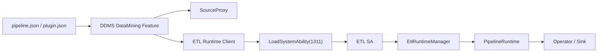
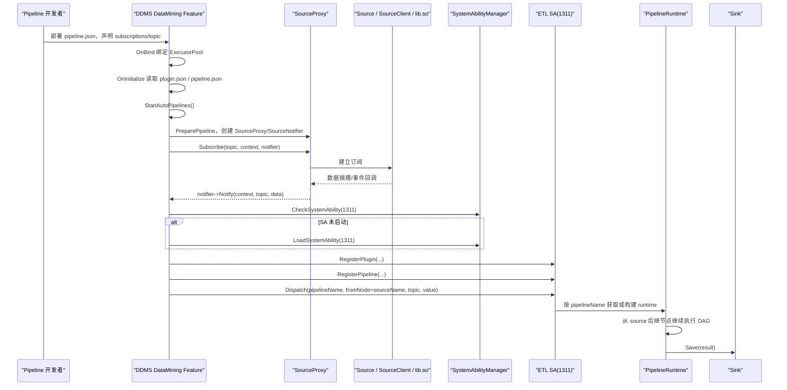
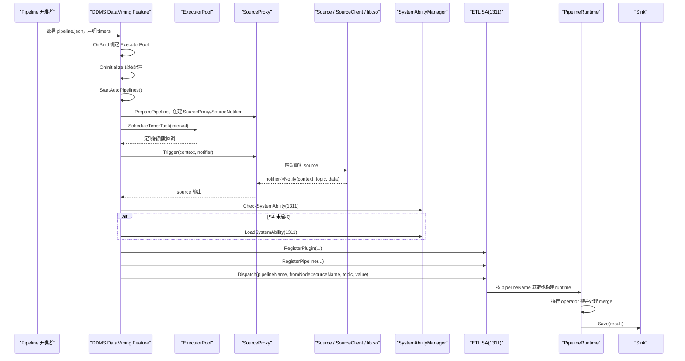

# 数据挖掘 ETL 模块说明

> 2026-03 当前版本说明：
> - 公共 ETL 客户端能力已经拆分到兄弟目录 `foundation/distributeddatamgr/data_mining`
> - demo 已经拆分到兄弟目录 `foundation/distributeddatamgr/data_mining_demo`
> - 本目录只保留 DDMS 侧的 feature 编排、source bridge、配置加载和触发调度
> - Operator 与 Sink 的真正运行时已经下沉到独立 ETL SA，SystemAbilityId 为 `1311`

## 1. 总体架构

当前实现已经按“常驻控制面”和“按需运行面”拆成三部分：

### 1.1 `foundation/distributeddatamgr/data_mining`

这是 ETL 的公共客户端部分，给 source/operator/sink 开发者和 pipeline 开发者使用，主要包含：

- `interfaces/`：`Source`、`Operator`、`Sink`、`AsyncNotifier`、`Context`、`DataValue`
- `model/`：`PluginDescription`、`PipelineDescription`
- `plugin/`：动态库注册导出接口
- `runtime/`：公共的 `PluginLoader`、`PluginRegistry`、`EndpointConfig`、transport 类型

这一层不依赖 DDMS feature，本质上是对外 SDK。

### 1.2 `datamgr_service/services/distributeddataservice/service/data_mining`

这是 DDMS 侧的 `data_mining` feature，本目录当前只负责：

- 在 `OnInitialize` 阶段读取 `plugin.json` 和 `pipeline.json`
- 解析 `pipeline.json` 中的订阅策略和定时策略
- 构建并缓存 `SourceProxy`
- 在需要时通过 `SourceProxy` 触发真实 source
- 通过 `LoadSystemAbility(1311)` 拉起 ETL SA
- 把 source 输出定向转发给 ETL SA

注意：

- DDMS 不执行 operator/sink
- DDMS 只处理 source 入口、调度、订阅、定时器和 IPC 转发
- `OnInitialize` 只会自动启动带自动触发策略的 pipeline，不会无差别 `StartAllPipelines`

### 1.3 `datamgr_service/services/data_mining_service`

这是独立的 ETL SA，负责：

- 接收 DDMS 发送的 plugin/pipeline 元数据
- 按 `pipelineName` 懒加载并缓存 `PipelineRuntime`
- 从某个 source 节点开始沿有向图继续执行 operator 和 sink
- 处理多父节点输入合流

SA 注册入口在：

- `services/data_mining_service/data_mining_etl_service.cpp`

运行时核心在：

- `services/data_mining_service/src/service/etl_runtime_manager.cpp`
- `services/data_mining_service/src/runtime/pipeline_runtime.cpp`

## 2. 当前职责边界

当前职责边界可以概括为：

其中：

- DDMS 侧只展开 source 视图，不构建 operator/sink 运行时
- ETL SA 只处理运行时，不关心配置目录扫描、定时器、订阅建立
- source 若为本地 `so`，按需 `dlopen`
- source 若未来走 SA/Extension，统一经 `SourceClient` 转发

## 3. `pipeline.json` 现在负责什么

`pipeline.json` 已经不是单纯描述有向图，还负责承载触发策略。

当前 `PipelineDescription` 里的关键字段如下：

- `name`：pipeline 唯一名
- `scene`：场景标签
- `trigger.subscriptions`：显式订阅配置
- `trigger.timers`：显式定时任务配置
- `trigger.type`：兼容历史 `manual` / `timer` / `hybrid`
- `tree`：source 到 operator/sink 的有向图

其中：

- `trigger.subscriptions` 决定 DDMS 要为哪些 source 建立 topic 订阅
- `trigger.timers` 决定 DDMS 要为哪些 source 创建定时任务
- 如果没有显式写 `subscriptions/timers`，DDMS 会回退到 `tree.mode` 和 `trigger.type` 做推导

对应定义在：

- `../data_mining/include/model/pipeline_description.h`

## 4. 初始化与装配流程

按当前 FeatureSystem 的真实调用顺序，DDMS feature 启动主流程如下：

1. `FeatureStubImpl::OnInitialize(executor)` 先调用 `DataMiningServiceImpl::OnBind(bindInfo)`
2. `OnBind()` 把 `ExecutorPool` 交给 `DataMiningManager::BindExecutors()`
3. `FeatureStubImpl::OnInitialize(executor)` 再调用 `DataMiningServiceImpl::OnInitialize()`
4. `OnInitialize()` 调用 `LoadDefaultConfigs(...)`
5. DDMS 扫描默认目录下的 `plugin.json` 和 `pipeline.json`
6. `RegisterPlugin()` 解析 plugin 描述，并把 `libs.path` 解析成受限的相对路径
7. `RegisterPipeline()` 解析 pipeline 描述并保存 `PipelineState`
8. `OnInitialize()` 再调用 `StartAutoPipelines()`
9. 只有带订阅/定时策略的 pipeline 会自动启动
10. 已启动 pipeline 的 timer 直接挂到当前 executor 上

这里的关键点：

- 自动启动入口是 `StartAutoPipelines()`，不是 `StartAllPipelines()`
- 纯 manual pipeline 会保留未启动状态，等 `TriggerPipeline()` 时再按需拉起
- `BindExecutors()` 仍然保留了“重新挂载 timer”的能力，用于 executor 替换和非主链路调用场景

## 5. DDMS 侧运行逻辑

### 5.1 Source 准备阶段

`DataMiningManager::PreparePipelineLocked()` 会按当前最新 `pipeline.json` 展开 source 视图：

- 遍历 `tree` 找出 source 节点
- 为每个 source 创建 `SourceProxy`
- 为每个 source 创建 `SourceNotifier`
- 根据显式 `trigger.subscriptions` / `trigger.timers` 或树上 `mode` 推导订阅和定时项
- 构建 `triggerSources`

这里故意只准备 source，不准备 operator/sink，因为它们属于 ETL SA 的运行时内存。

### 5.2 SourceProxy 行为

`SourceProxy` 统一屏蔽三种 source 形态：

- 已注入对象：主要给测试或内存对象使用
- 本地动态库：首次真正使用时 `dlopen`
- 远端 source：通过 `SourceClient` 转发

这意味着：

- 订阅型 source 在 `Subscribe()` 时才真正进入 source 实现
- 定时型或手动型 source 在 `Trigger()` 时才真正进入 source 实现
- 本地 `so` source 不会在 DDMS 启动时整体预加载

## 6. ETL SA 侧运行逻辑

DDMS 把 source 输出送到 SA 后，ETL SA 当前流程如下：

1. `SaEtlRuntimeClient` 先 `CheckSystemAbility(1311)`
2. 若未拉起，则 `LoadSystemAbility(1311)`
3. DDMS 把 plugin/pipeline 元数据发送给 SA
4. DDMS 再发送一条 `DispatchRequest`
5. `DispatchRequest` 中包含 `pipelineName`、`fromNode`、`topic`、`context` 和 value
6. `EtlRuntimeManager` 按 `pipelineName` 找对应 runtime
7. 若 runtime 不存在，则按该 pipeline 懒构图
8. `PipelineRuntime::DispatchFrom(fromNode, ...)` 从 source 对应的后继节点继续执行

这里有两个关键结论：

- ETL SA 不会因为注册了多个 pipeline 就一次执行全部 pipeline
- 每次 dispatch 都带 `pipelineName`，SA 只会命中对应的那一条 pipeline runtime

## 7. 订阅制时序图

订阅制下，source 主动向外部数据捐赠或事件系统订阅，回调后由 DDMS 转发到 ETL SA。

## 8. 定时任务制时序图

定时任务制下，DDMS 持有定时器，定时器回调时才触发 source。

## 9. 多 pipeline 的行为说明

当系统里注册了多个 pipeline 时，当前行为是：

- DDMS 按 pipeline 维度保存 `PipelineState`
- 每个 pipeline 有自己的一组 `subscriptions`、`timers`、`sources`
- source 回调转发时会显式带上 `pipelineName`
- SA 侧 runtime 也是按 `pipelineName` 缓存

因此：

- 一次 source 回调，只会 dispatch 到对应 pipeline
- 一次定时器触发，只会触发对应 pipeline 的 source
- ETL SA 不会收到一次触发就把所有 pipeline 全跑一遍

需要注意的只有一个边界：

- 如果多个 pipeline 同时订阅了同一个 source/topic，那么会出现多次独立触发，这是前面的多条订阅导致的，不是 SA 广播执行

## 10. 多父节点合流

`PipelineRuntime` 当前支持图状 pipeline。

当一个 operator 有多个父节点时：

- `inputParents_` 记录它所有上游父节点
- `pendingInputs_` 暂存各父节点输出
- 等待所有父节点输入到齐后，运行时会构造合流后的 `MergedDataValue`
- 然后再把合流结果送给当前 operator

这也是当前 `context_operator`、`travel_entity_extract_operator` 这类汇聚型节点能工作的基础。

## 11. 关键类职责索引

DDMS feature 侧：

- `data_mining_service_impl.cpp`：Feature 生命周期入口
- `src/service/data_mining_manager.cpp`：DDMS 总控、配置加载、启动、调度、转发
- `src/runtime/source_proxy.cpp`：统一封装本地库/远端 source
- `src/service/etl_runtime_client.cpp`：拉起 SA 并做 IPC 转发

ETL SA 侧：

- `services/data_mining_service/data_mining_etl_service.cpp`：SA 入口与发布
- `services/data_mining_service/src/service/etl_runtime_manager.cpp`：pipeline/runtime 管理
- `services/data_mining_service/src/runtime/pipeline_runtime.cpp`：有向图装配、路由、merge、operator/sink 调度

公共客户端侧：

- `../data_mining/include/interfaces/`
- `../data_mining/include/model/`
- `../data_mining/include/plugin/`

## 12. 当前限制

当前版本还有这些边界：

- source 的 SA/Extension 远端通路目前还是占位骨架，真实远端 source 能力尚未补齐
- plugin 注册仍按 `opName` 建索引，同名算子若配置成不同实现，后注册的会覆盖前注册的
- DDMS 每次 dispatch 前会把当前 plugin/pipeline 元数据同步给 SA，后续还可以继续优化增量同步
- 本轮主要做了结构和流程重构，文档、UT、FUZZ 已跟上主链路，但仍建议在完整编译环境下继续做联调验证
